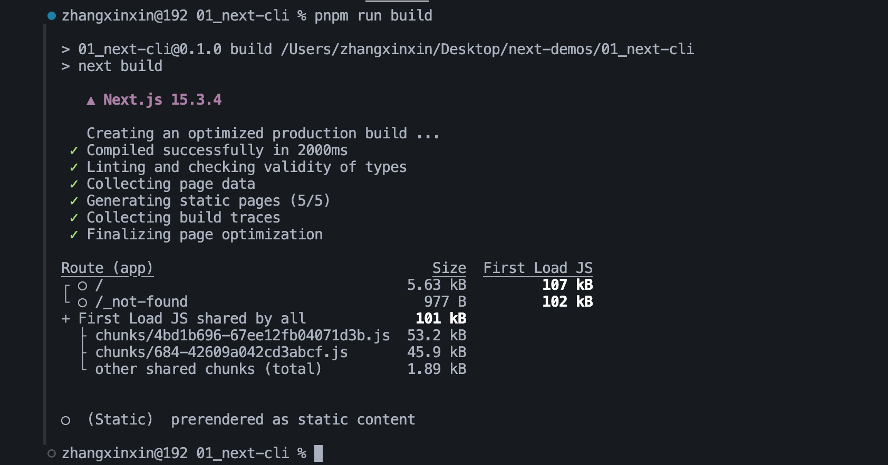
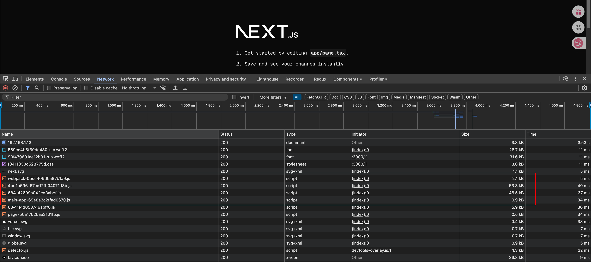

# NestCLI
```js
  "scripts": {
    "dev": "next dev --turbopack",
    "build": "next build",
    "start": "next start",
    "lint": "next lint"
  }
```
通过查看package.json可以看到,当执行`npm run dev` `npm run build` `npm run start` `npm run lint`的时候,其实执行的是`next dev` `next build` `next start` `next lint`, 而这个`next`就来自于`next-cli`,next-cli可以帮助我们启动,构建,执行代码eslint代码检测.

# 查看NextCLI的所有命令
可以执行`npx next -h(-h是--help的缩写)`就可以看到所有的NextCLI提供的命令

# 为什么要用`npx`?
因为现在使用的是npx创建的项目,通过npx创建项目的这种方式避免了全局安装`create-next-app`,所以我们本地现在并没有`next命令`

# next build
执行`next build`将会得到项目的生产优化版本,构建后的输出如下:


从上图可以看出,构建时会输出每条路由的信息,比如Size和First Load JS.
注意: 这些值指的都是gzip压缩后的大小,其中First Load JS会用`绿色` `黄色` `红色`表示,`绿色代表高性能`,`红色和黄色表示需要优化`.

Size和First Load JS他俩有什么用?

正常我们使用nextjs开发的项目,其页面表现类似于单页应用,即路由跳转(我们称之为导航)的时候,页面不会刷新,而是会加载目标路由所需的资源然后进行展示.
```js
// 所以: Size和First Load JS的关系就是
加载目标路由一共所需的资源大小(JS)  = 每个路由都需要依赖的资源(JS)大小 + 目标路由单独依赖的资源(JS)大小

// 加载目标路由一共所需的JS大小就是First Load JS 
// 目标路由单独依赖的JS大小就是Size
// 每个路由都需要依赖的JS大小就是图中单独列出来的First Load JS shared by all, 也就是说:
First Load JS = Size + First Load JS shared by all

以上图中的 / 路由地址为例子,107kb(First Load JS) = 5.63kb(Size) + 101kb(First Load JS shared by all) 

// 使用官方文档上的话就是
// Size: 导航到该路由时下载的资源大小,每个路由的大小只包括它自己的依赖项
// First Load JS: 加载该页面时下载的资源大小
// First Load JS shared by all: 所有路由共享的JS大小会被单独列出来
```

运行`pnpm run start`


上图红色框住的JS是每个页面都需要加载的JS,根据命令行中的输出,总共大小为101KB, `63-11f4d058746abff6.js`和`page-56a17625aa3101f5.js`就是这个页面单独的JS,总共大小为5.63KB,所有JS资源大小为107KB.

注意:浏览器中的KB大小没有和build出来的KB大小一致,是因为浏览器哪里没有开启gzip压缩

# next build --profile
该命令参数用于开启React的生产性能分析(需要Nextjs v9.5以上)
```js
npx next run build --profile // 或者可以在package.json中把 next build修改为 next build --profile
``
然后就可以在浏览器中的React调试插件中使用profiler功能

# next build --debug
该命令参数用于开启更详细的构建输出:
```js
npx next build --debug // 开启后，将输出额外的构建输出信息如 `rewrites`、`redirects`、`headers`
```

# next dev
开发模式下，使用 `next dev` 运行程序，会自动具有热加载、错误报告等功能。默认情况下，程序将在 `http://localhost:3000` 开启。如果你想更改端口号：
```js
npx next dev -p 4000
```

如果你想更改主机名（hostname）：（以便其他主机访问）:
```js
npx next dev -H 192.1.5
```

# next start
生产模式下，使用 `next start`运行程序。不过要先执行 `next build`构建出生产代码。运行的时候，跟开发模式相同，程序默认开启在 `http://localhost:3000`。如果你想更改端口号：
```js
npx next start -p 5000
```

# next lint
执行 `next lint`会为 `pages/`、`app/`、`components/`、`lib/`、`src/`目录下的所有文件执行 ESLint 语法检查。如果你没有安装 ESLint，该命令会提供一个安装指导。如果你想要指定检查的目录：
```js
npx next lint --dir utils
```

# next info
`next info`会打印当前系统相关的信息，可用于报告 Next.js 程序的 bug。在项目的根目录中执行：
```js
npx next info
```